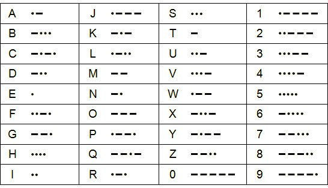

# О проекте

Весь проект выполнен на базе платы [DE1-SoC](https://www.terasic.com.tw/cgi-bin/page/archive.pl?Language=English&No=836).

Основная цель проекта — ...

**Ключевые оссобенности:**
*   Декрдирование латинских букв (A-Z) и цифр (0-9)
*   Вывод на индикатор букв и цифр

# Что-то про морзе
...

# Отображение на индикаторе
...

